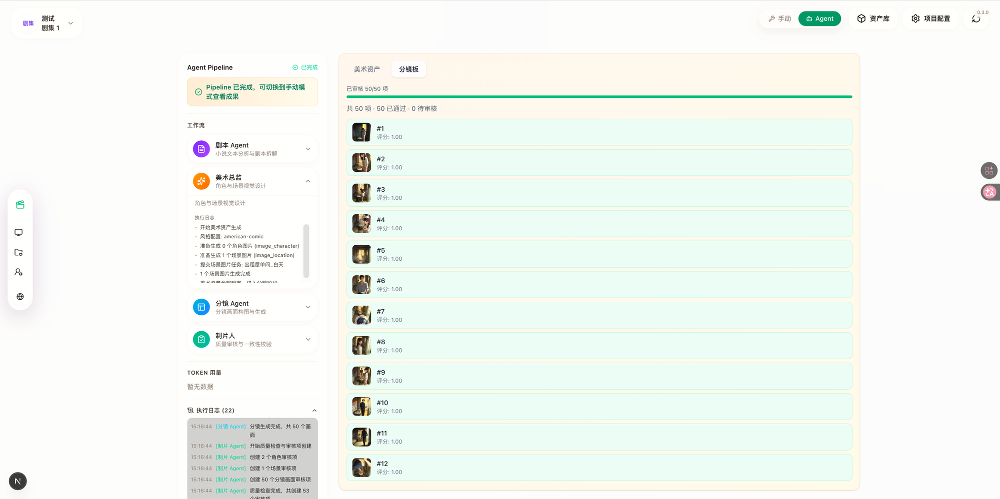
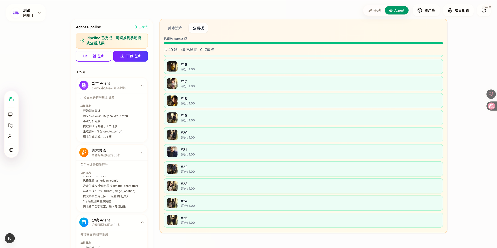

# AgentCine

<p align="center">
  
</p>

<p align="center">
  一个面向 AI 影视创作流程的工作台：从文本分析、角色与场景资产管理，到分镜生成、配音与视频任务编排，统一在同一个项目工作区内完成。
</p>

<p align="center">
  <a href="README_en.md">English</a>
</p>

---

## 预览





---

## 项目简介

AgentCine 是一个基于 Next.js 15 + React 19 构建的 AI 影视制作平台。当前仓库已经包含：

- 文本到项目的创作工作区
- 全局素材库与项目内素材复用
- 角色、场景、分镜、台词、配音、视频等多类任务流
- API 配置中心，可接入多种模型与媒体服务
- BullMQ Worker + Watchdog 的异步任务执行体系
- 基于 Prisma 的数据层，以及 MinIO/S3 兼容媒体存储

从当前代码结构看，项目核心围绕以下模块展开：

- `workspace`：项目工作区与创作主流程
- `asset-hub`：全局角色、场景、声音等素材管理
- `profile/api-config`：模型与服务商配置中心
- `api/novel-promotion/*`：项目内分析、分镜、图片、语音、视频等接口
- `src/lib/workers`：后台任务消费

---

## 主要能力

- AI 文本分析：将文本内容拆解为角色、场景、镜头与创作素材
- 角色与场景资产管理：支持项目内资产与全局资产协同
- 分镜生成与编辑：围绕 storyboard / shot / panel 组织创作流程
- 配音与角色声音绑定：支持语音分析、角色配音、台词音频生成
- 视频任务编排：支持视频生成、下载、代理访问与媒体引用管理
- 媒体统一存储：图片、音频、视频通过 MinIO / S3 兼容存储统一管理
- 配置中心：支持 OpenAI Compatible 等模型接入配置
- 后台队列执行：通过 Redis + BullMQ 处理高耗时生成任务

---

## 技术栈

- 前端框架：Next.js 15、React 19
- 语言与运行时：TypeScript、Node.js 18+
- 数据库：MySQL + Prisma
- 队列系统：Redis + BullMQ
- 媒体与视频：Remotion、Sharp
- 认证：NextAuth.js
- 样式：Tailwind CSS v4
- 对象存储：MinIO / S3 兼容接口

---

## 目录概览

```text
src/app/[locale]/workspace         项目工作区
src/app/[locale]/workspace/asset-hub  全局素材库
src/app/api/novel-promotion        创作主流程 API
src/app/api/asset-hub              素材库 API
src/app/api/user/api-config        配置中心 API
src/lib/workers                    队列消费者
prisma/                            数据模型
scripts/                           守护、迁移、检查脚本
```

---

## 快速开始

### 环境要求

- Node.js `>= 18.18.0`
- npm `>= 9.0.0`
- Docker / Docker Compose

### 方式一：Docker 一键启动

项目根目录已提供 `docker-compose.yml`，默认启动以下服务：

- MySQL
- Redis
- MinIO
- AgentCine 应用

执行：

```bash
docker compose up -d
```

启动后访问：

- 应用：`http://localhost:13000`
- Bull Board：`http://localhost:13010/admin/queues`
- MinIO Console：`http://localhost:19001`

首次启动时容器会自动执行：

- `prisma db push`
- 应用服务启动
- Worker / Watchdog / Bull Board 并行运行

### 方式二：本地开发

1. 安装依赖

```bash
npm install
```

2. 启动基础设施

```bash
docker compose up mysql redis minio -d
```

3. 准备环境变量

```bash
cp .env.example .env
```

4. 同步数据库

```bash
npx prisma db push
```

5. 启动开发环境

```bash
npm run dev
```

本地开发默认访问：

- 应用：`http://localhost:3000`
- 队列面板：`http://localhost:3010/admin/queues`

---

## 环境变量说明

可参考仓库中的 [`.env.example`](/Users/niu/AgentCine/.env.example)。

重点配置项包括：

- `DATABASE_URL`：MySQL 连接串
- `REDIS_HOST` / `REDIS_PORT`：队列与任务状态依赖
- `STORAGE_TYPE`：默认 `minio`
- `MINIO_*`：对象存储配置
- `NEXTAUTH_URL` / `NEXTAUTH_SECRET`：认证配置
- `CRON_SECRET` / `INTERNAL_TASK_TOKEN` / `API_ENCRYPTION_KEY`：内部安全配置
- `BULL_BOARD_*`：任务管理面板配置

应用启动后，还可以在站内的 API 配置中心补充模型提供商、接口地址与密钥。

---

## 开发脚本

常用命令：

```bash
npm run dev
npm run build
npm run start
npm run lint
npm run test:unit:all
npm run test:integration:api
npm run test:integration:chain
npm run test:behavior:full
```

项目还内置了大量守护与一致性检查脚本，例如：

- 模型配置契约检查
- 媒体引用一致性检查
- API 路由与测试覆盖检查
- Prompt / i18n 回归检查

---

## Agent 模式

项目包含两套 Agent 系统，分别适用于不同场景。两者最终都通过 BullMQ 提交相同的任务（图片生成、文本分析等）来执行实际的 AI 工作。

### 模式一：Agent Sessions（对话式，LLM 自主决策）

> 入口：`POST /api/agent/sessions`｜代码：`src/lib/agent/`

LLM 在每轮循环中自主观察项目状态、思考下一步行动并执行，支持人工在关键节点介入审批。

```
用户发起请求 → 创建 Session → 启动 Agent 循环
                                    │
                        ┌───────────┘
                        ▼
                    OBSERVE ── 查询数据库，获取当前项目状态
                        │       （角色、场景、分镜、面板、任务进度等）
                        ▼
                     THINK ─── LLM 分析现状，决定下一步操作
                        │       （使用 reasoning: high 模式）
                        ▼
                  CHECKPOINT? ─ 若命中审批节点，暂停等待用户批准/拒绝
                        │       （通过 WebSocket + Redis pub/sub 通知前端）
                        ▼
                      ACT ──── 调用 Skill（封装的 BullMQ 任务），等待完成
                        │       （submit-and-wait 或 fire-and-forget 两种模式）
                        ▼
                    REFLECT ── 记录决策到 EpisodicMemory，更新对话历史
                        │
                        └────→ 循环，直到 LLM 判定 done 或达到上限
```

**核心组件：**

| 组件 | 路径 | 职责 |
|------|------|------|
| Agent 循环引擎 | `src/lib/agent/core/agent-loop.ts` | observe/think/act/reflect 主循环 |
| DirectorAgent | `src/lib/agent/agents/director.ts` | 当前唯一实现的 Agent，统管全流程 |
| Skills（工具） | `src/lib/agent/skills/` | 封装 BullMQ 任务为 Agent 可调用的工具 |
| 行为控制 | `src/lib/agent/core/behavior-control.ts` | 审批策略、checkpoint 管理 |
| 三层记忆 | `src/lib/agent/memory/` | ShortTerm（内存）+ LongTerm（Prisma）+ Episodic（Prisma） |
| 事件总线 | `src/lib/agent/core/event-bus.ts` | Redis pub/sub，驱动实时通知 |
| WebSocket 网关 | `src/lib/agent/gateway/` | 实时双向通信（思考、工具调用、checkpoint 等） |
| 前端面板 | `src/components/agent/AgentChatPanel.tsx` | 浮动聊天面板，展示 Agent 状态与交互 |

**可用 Skills：** 文本分析、剧本转换、角色/场景图片生成、分镜生成、面板图片生成、配音分析、语音生成、视频生成等。

**终止条件：** LLM 声明完成 / 取消信号 / 达到循环上限（200次）/ 连续错误上限（5次）/ 总成本上限。

### 模式二：Agent Pipeline（确定性，图执行）

> 入口：`POST /api/novel-promotion/[projectId]/pipeline/start`｜代码：`src/lib/agent-pipeline/`

固定顺序的四阶段流水线，无 LLM 路由决策。使用 LangGraph `StateGraph` 编排，内置重试与质量审查。

```
┌─────────────┐    ┌──────────────────┐    ┌────────────────┐    ┌──────────────────┐
│ ScriptAgent  │───▶│ ArtDirectorAgent │───▶│ StoryboardAgent│───▶│ ProducerAgent    │
│ 剧本 Agent   │    │ 美术总监          │    │ 分镜 Agent      │    │ 制片 Agent        │
└─────────────┘    └──────────────────┘    └────────────────┘    └──────────────────┘
  · 分析小说文本       · 生成角色图片           · 为每集生成分镜        · 创建审查项
  · 提取角色/场景      · 生成场景图片           · 批量生成面板图片      · 自动评分
  · 逐集剧本转换       · 锁定资产状态           · 更新完成状态         · 进入人工审核
```

**状态流转：**

```
queued → running → review → completed
                 ↘ failed
                 ↘ paused
```

**核心组件：**

| 组件 | 路径 | 职责 |
|------|------|------|
| Pipeline 入口 | `src/lib/agent-pipeline/index.ts` | 启动流水线，预校验配置 |
| 图定义 | `src/lib/agent-pipeline/graph/super-graph.ts` | 四节点线性图 |
| 四个 Agent 节点 | `src/lib/agent-pipeline/graph/nodes/` | ScriptAgent / ArtDirector / Storyboard / Producer |
| Pipeline 状态 | `src/lib/agent-pipeline/graph/state.ts` | 跨节点传递的状态对象 |
| 图执行引擎 | `src/lib/run-runtime/graph-executor.ts` | 节点执行、超时、重试、取消 |
| LangGraph 集成 | `src/lib/run-runtime/langgraph-pipeline.ts` | LangGraph StateGraph 封装 |
| 任务等待 | `src/lib/agent-pipeline/graph/task-wait.ts` | DB 轮询（2s 间隔，15min 超时） |
| 质量审查 | `src/lib/agent-pipeline/asset-layer/consistency-checker.ts` | 视觉模型一致性评分 |
| 审查服务 | `src/lib/agent-pipeline/review-service.ts` | 审查项 CRUD、批准/拒绝 |
| Pipeline 日志 | `src/lib/agent-pipeline/pipeline-log.ts` | 结构化日志（JSON 数组存储） |
| 事件持久化 | `src/lib/run-runtime/service.ts` | GraphRun / GraphStep / GraphEvent 管理 |

**质量审查流程：** ProducerAgent 完成后，pipeline 进入 `review` 状态。所有角色、场景、面板自动生成审查项。`strict` 模式下全部需要人工审核；`standard`/`relaxed` 模式下高于阈值（默认 0.7）的自动通过，低于阈值的自动重试（最多 3 次），超出重试次数的标记为需人工处理。全部审查项处理完成后，pipeline 状态变为 `completed`。

### 两种模式对比

| 维度 | Agent Sessions | Agent Pipeline |
|------|---------------|----------------|
| 决策方式 | LLM 每轮自主决定下一步 | 固定图顺序，无 LLM 路由 |
| 实时通信 | WebSocket（双向） | SSE（`/api/sse`）+ DB 轮询 |
| 状态管理 | 对话历史 + 三层记忆 | PipelineState 对象逐节点传递 |
| 人工介入 | Checkpoint 交互式审批 | 质量审查项（完成后批量审核） |
| 任务等待 | Redis pub/sub（实时） | 数据库轮询（2s 间隔） |
| 持久化 | agentSession / agentMessage / agentMemoryEntry | pipelineRun / graphRun / graphStep / graphEvent / pipelineReviewItem |
| 适用场景 | 灵活探索、交互式创作 | 批量生产、确定性流程 |

---

## 运行架构

项目默认不是单纯的前端站点，而是一个包含多进程协作的应用：

- Next.js 负责页面与 API 路由
- Worker 负责消费图片、视频、语音、文本任务
- Watchdog 负责任务心跳与异常处理
- Bull Board 提供队列可视化管理页面
- MySQL 持久化项目、任务、配置与媒体引用
- Redis 负责队列与任务状态流转
- MinIO 负责媒体对象存储

因此无论是 Docker 部署还是本地开发，都建议把应用、数据库、Redis、对象存储一起启动。

---

## 说明

本 README 已按当前仓库实际结构重写，并将项目统一命名为 `AgentCine`。

项目在实现与产品思路上参考了：

- https://github.com/saturndec/waoowaoo
