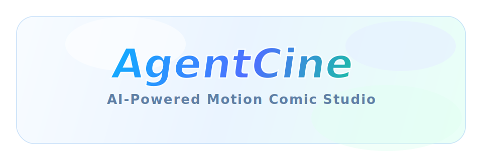

# AgentCine

<p align="center">
  
</p>

<p align="center">
  A workspace for AI-driven cinematic creation, covering text analysis, character and scene asset management, storyboard generation, voice workflows, and video task orchestration in one project environment.
</p>

<p align="center">
  <a href="README.md">中文文档</a>
</p>

---

## Overview

AgentCine is an AI filmmaking platform built with Next.js 15 and React 19. Based on the current repository, it already includes:

- A project workspace for AI-assisted creation flows
- A global asset hub with project-level asset reuse
- Task pipelines for characters, locations, storyboards, voice lines, dubbing, and video
- An API configuration center for model and media provider setup
- An asynchronous execution stack powered by BullMQ workers and a watchdog
- Prisma-based data management and MinIO / S3-compatible media storage

From the current code structure, the main areas are:

- `workspace`: the main project creation workflow
- `asset-hub`: global management for characters, locations, and voices
- `profile/api-config`: provider and model configuration center
- `api/novel-promotion/*`: project APIs for analysis, storyboard, image, voice, and video generation
- `src/lib/workers`: background task consumers

---

## Core Capabilities

- AI text analysis: convert source text into characters, locations, shots, and structured creative assets
- Character and location asset management: coordinate project-local and global assets
- Storyboard generation and editing: organize creation around storyboard / shot / panel workflows
- Voice workflows and speaker binding: support voice analysis, character voice assignment, and line-level audio generation
- Video task orchestration: support generation, download, proxy access, and media reference handling
- Unified media storage: manage images, audio, and video through MinIO / S3-compatible storage
- Config center: connect OpenAI-compatible and other provider endpoints
- Background queue execution: process long-running generation tasks through Redis + BullMQ

---

## Tech Stack

- Frontend framework: Next.js 15, React 19
- Language and runtime: TypeScript, Node.js 18+
- Database: MySQL + Prisma
- Queue system: Redis + BullMQ
- Media and video: Remotion, Sharp
- Authentication: NextAuth.js
- Styling: Tailwind CSS v4
- Object storage: MinIO / S3-compatible interfaces

---

## Repository Layout

```text
src/app/[locale]/workspace            project workspace
src/app/[locale]/workspace/asset-hub  global asset hub
src/app/api/novel-promotion           main creation APIs
src/app/api/asset-hub                 asset hub APIs
src/app/api/user/api-config           config center APIs
src/lib/workers                       queue consumers
prisma/                               data models
scripts/                              watchdog, migration, and guard scripts
```

---

## Quick Start

### Requirements

- Node.js `>= 18.18.0`
- npm `>= 9.0.0`
- Docker / Docker Compose

### Option 1: Start with Docker

The repository already includes `docker-compose.yml`, which starts:

- MySQL
- Redis
- MinIO
- The AgentCine application

Run:

```bash
docker compose up -d
```

Then open:

- App: `http://localhost:13000`
- Bull Board: `http://localhost:13010/admin/queues`
- MinIO Console: `http://localhost:19001`

On first startup, the container automatically runs:

- `prisma db push`
- the application service
- Worker / Watchdog / Bull Board in parallel

### Option 2: Local Development

1. Install dependencies

```bash
npm install
```

2. Start infrastructure services

```bash
docker compose up mysql redis minio -d
```

3. Prepare environment variables

```bash
cp .env.example .env
```

4. Sync the database

```bash
npx prisma db push
```

5. Start the development environment

```bash
npm run dev
```

In local development, the defaults are:

- App: `http://localhost:3000`
- Queue board: `http://localhost:3010/admin/queues`

---

## Environment Variables

See [`.env.example`](/Users/niu/AgentCine/.env.example) for the full template.

Key settings include:

- `DATABASE_URL`: MySQL connection string
- `REDIS_HOST` / `REDIS_PORT`: queue and task-state dependencies
- `STORAGE_TYPE`: defaults to `minio`
- `MINIO_*`: object storage settings
- `NEXTAUTH_URL` / `NEXTAUTH_SECRET`: authentication settings
- `CRON_SECRET` / `INTERNAL_TASK_TOKEN` / `API_ENCRYPTION_KEY`: internal security settings
- `BULL_BOARD_*`: queue dashboard settings

After startup, you can also configure providers, endpoints, and API keys inside the in-app config center.

---

## Development Scripts

Common commands:

```bash
npm run dev
npm run build
npm run start
npm run lint
npm run test:unit:all
npm run test:integration:api
npm run test:integration:chain
npm run test:behavior:full
```

The project also includes many guard and consistency checks, including:

- model config contract checks
- media reference consistency checks
- API route and test coverage checks
- prompt and i18n regression checks

---

## Runtime Architecture

This is not just a frontend app. By default, the system runs as a multi-process application:

- Next.js serves pages and API routes
- Worker processes image, video, voice, and text tasks
- Watchdog handles task heartbeats and abnormal states
- Bull Board provides queue visualization
- MySQL persists projects, tasks, configs, and media references
- Redis drives queue execution and task state transitions
- MinIO stores media objects

For both Docker deployment and local development, it is best to run the app together with the database, Redis, and object storage.

---

## Preview


---

## Notes

This README has been rewritten to match the current repository structure and the `AgentCine` project name.

This project references:

- https://github.com/saturndec/waoowaoo
